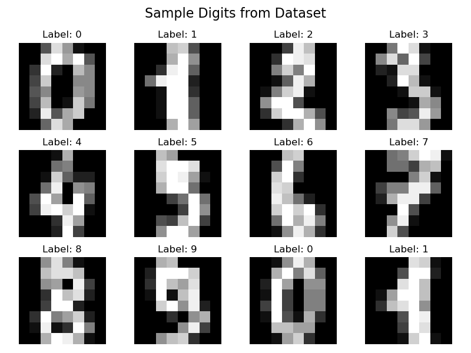
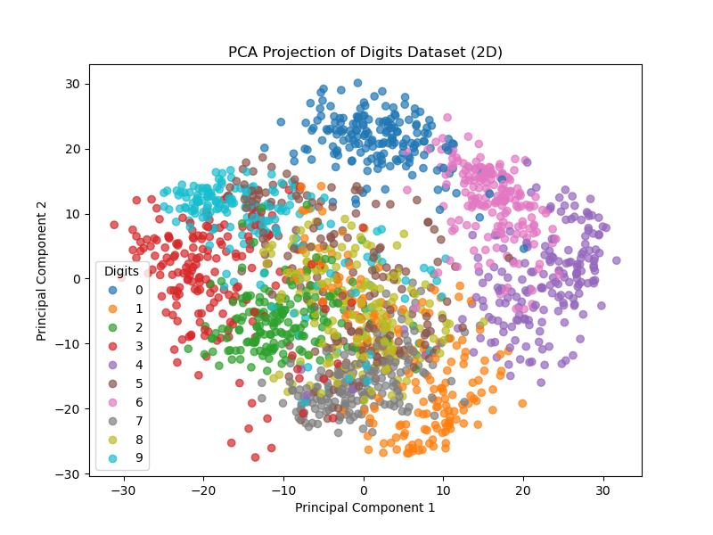
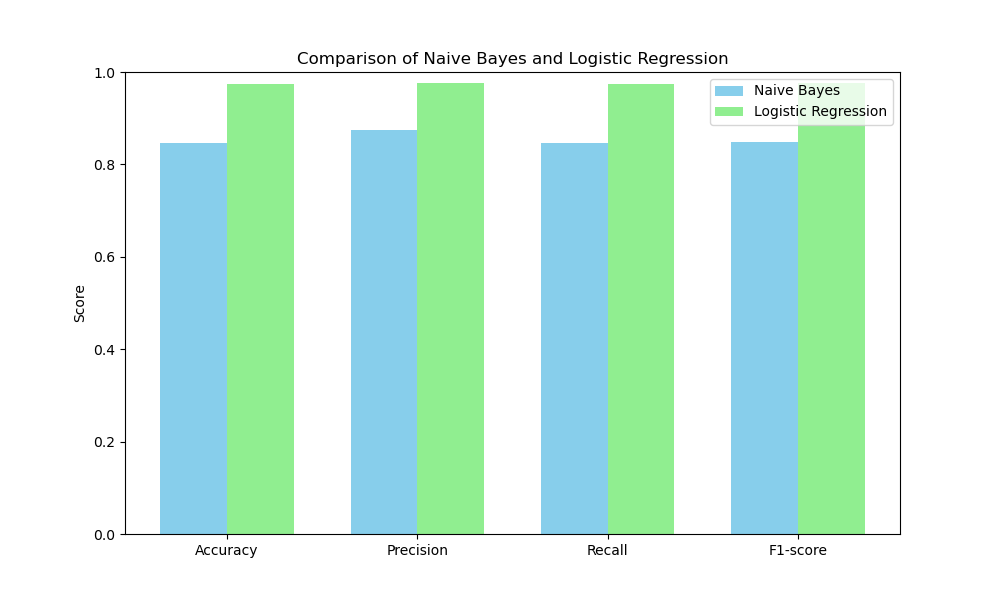

# Comparative Study of Naive Bayes and Logistic Regression on Digits Dataset
##  Project Structure
├── assignment1.py          
├── data_visualization.py   
├── pca.py                  
├── sample_digits.png       
├── pca_digits.png         
├── model_comparison.png   
└── README.md              

---

##  Abstract
This project presents a comparative study of two machine learning algorithms, **Naive Bayes** and **Logistic Regression**, applied to image classification on the **Digits dataset**.  
The study includes:
- Visualization of the dataset  
- Dimensionality reduction using **Principal Component Analysis (PCA)**  
- Evaluation of model performance using **Accuracy, Precision, Recall, and F1-score**

---


##  Requirements
Install the required dependencies before running the project:

```bash
pip install matplotlib scikit-learn numpy
```
---
##  How to Run

### 1. Data Visualization
Run the following to visualize sample digit images:

```bash
python3 data_visualization.py
```



---


### 2. PCA Projection

Run the following to project the dataset into 2D PCA space:

```bash
python3 pca.py
```



---

### 3. Model Training & Comparison

Run the following to train Naive Bayes and Logistic Regression, and compare their performance:

```bash
python3 assignment1.py
```
---

##  Comparison of Naive Bayes and Logistic Regression

The performance metrics of the two models are shown below:

| Model               | Accuracy | Precision | Recall | F1-score |
|---------------------|----------|-----------|--------|----------|
| Naive Bayes         | 0.847    | 0.88      | 0.85   | 0.85     |
| Logistic Regression | 0.975    | 0.98      | 0.97   | 0.98     |


###  Performance Visualization
The comparison is also illustrated in the following bar chart:



##  Summary

From the [performance table](#-comparison-of-naive-bayes-and-logistic-regression) and the [performance figure](#-performance-visualization), it is clear that **Logistic Regression outperforms Naive Bayes** across all metrics.


